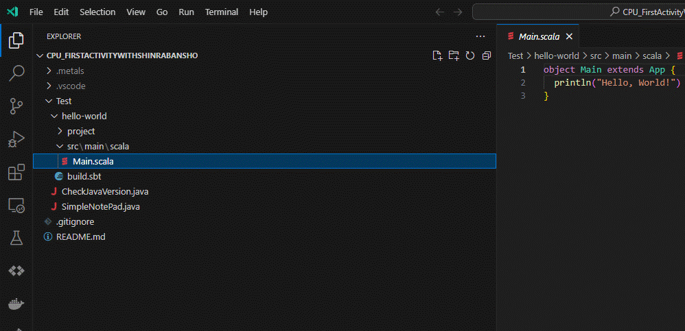

最終更新：2024/05/07：metalsメインから公式sbtメインの選択肢を追加   
  
---------------------------  
  
こんにちは！森羅万象プロジェクトです！  
いきなりですが、今回からさっそく**CPUを作っていきたい**と思います。
  
ちなみにこの記事は、  
**CPUを作ったことのない人の、**  
**CPUを作ったことのない人による、**  
**CPUを作ったことのない人のための記事**  
ですので、CPU入門・初心者の筆者と一緒に勉強していただけたらと思っています！！
  
今回は、「CPUを自作するための基盤」を用意していきます。  
**1.CPUって一人でつくれるの！？**  
**2.出てくる用語を簡単に解説**  
**3.今回のCPUづくりにつかうもの**  
について話していきます。

# 1.CPUって一人で作れるの！？
  
- CPUってどんな部品なのかと言われたら、「○○装置とついている中の、演算装置・記憶装置」　「3が一番弱くて、5、7、9がつくと強くなる」 「製造プロセス(nm)が小さいほど性能が良くなる」などと答える人が多いのではないでしょうか。  
- 筆者も作り始める前は、「どのような命令を読み取ってどのように処理するんだろう」　「めっちゃ細い銅線と半導体、NAND回路をいい感じに組めたらおk？」　「裏でポインタとかメモリアドレスをいい感じに振り分けてくれてるんだろうなぁ」　なんて思っていました。  
  
- 実際、CPUはいい感じの回路が組めて、命令を読み取って、演算・記憶できるものが市販されているのでしょう。（じゃないと売れないですもんね。）でも、ネットを見たり、ゲームをしたりできるような命令や演算ができるものを個人で制作するのは至難の業です。  
- ただ、仮に必要最低限のCPUをつくった(つくれる)のならば、市販されているCPUはその拡張や応用でつくられていると思えるようになるかもしれません。また、もしあなたがC言語やC++、Go言語やRustといったプログラミング言語を勉強する機会があれば、つまずく人の多いポインタやアドレスの原理が理解しやすくなるかもしれません（これは個人的な体験談ですが）。  
  
**まあ、とにかく、ダマされたと思って始めてみませんか？** 筆者もよくわからないままつくり始めて、なんとかなっているので、、、  
  
# 2.出てくる用語を簡単に解説  
(筆者調べ≒正確、ではありません、あくまで参考までに。)  

### テキストエディタ：Visual Studio Code
- あくまでもテキストエディタであってIDE(統合開発環境)ではない。  
- [Visual Studio Code](https://code.visualstudio.com/) のExtension(拡張機能)がつよつよすぎてプログラミングに用いられるようになった。  
- ちなみに筆者は無料の↑コレと有料のIDE[(Jetbrains製品)](https://www.jetbrains.com/)を使ったことがあるが、色々な言語やライブラリを使って学習・開発したいのであればVSCode、特化した言語やフレームワークを使っての開発やお仕事で指定されている開発ではIDEを利用することも割とあるので、どちらも使えるようになって損はないと思っている。
  
### プログラミング言語：Java, Scala, Chisel
- Javaは王道といってよいほどの知名度、プロダクトがある。大規模開発が得意。  
- ScalaはJavaっぽく、良いとこ取りで作られた言語で、データ処理が得意。  
- [Chisel](https://www.chisel-lang.org/)はScalaの[DSL](https://www.jetbrains.com/ja-jp/mps/concepts/domain-specific-languages/)で、ハードウェア設計に特化。  
  - （このプロジェクトで筆者はScalaとChiselとやらを知った、なんてメンバーには言えない。）
  
# 3.今回のCPUづくりにつかうもの  
今回は以下のものを使ってCPUを作っていきます。（クッキングみたい。）  
- 開発環境：[Visual Studio Code](https://code.visualstudio.com/Download)
- Visual Studio Code内で必要なプラグイン：
  - Extension Pack for [Java](https://www.oracle.com/java/technologies/javase-downloads.html)
  - [Scala](https://www.scala-lang.org/download/) (Metals)
  - Scala Syntax (official)  
- サンプルコード：[筆者のGitHub](https://github.com/Astalisks/CPU_FirstActivityWithShinrabansho)
  
  
### これが動けばOK！！  
  

  
とりあえず、このディレクトリをgit cloneしてきて、中のJavaプログラム×2とScalaプログラムが動けばOKです。  
できる方はどんな手を使ってもよいので、どうぞ。

### 筆者はこうやりました
  
（参考までに、筆者はWindows11を使っています。　上手くいかない場合はインターネットや友人に相談してみてください。）

1. Visual Studio Codeを[公式サイト](https://code.visualstudio.com/Download)からダウンロードしてインストール  
（インストールに関しては全部デフォルトでOKしました）  
- 筆者の個人的ポイント：Visual Studio Codeを起動して、新しいプロジェクトを作成する際は、  
「Open Folder」→新しく「VScodeProjects」を作成し中へ（筆者は「s」忘れてますね）→「GithubProjects」に保存するようにしています。  
オンライン上にアップロードしない「LocalProjects」、特定の大きめのプロジェクトがあるならその名前のプロジェクト「（筆者は研究があったので）ServeyProjects」、もう更新しなそうなプロジェクト「ArchiveProjects」などに分けて作ると後々見返したときにわかりやすいかも、、？  
    
  
2. VS code左上の「Terminal」から（無ければ「...」になっているかも）[筆者のGitHub](https://github.com/Astalisks/CPU_FirstActivityWithShinrabansho)から、このディレクトリをgit clone  
```
git clone https://github.com/Astalisks/CPU_FirstActivityWithShinrabansho
```  
- 筆者の個人的ポイント：先ほどの「GithubProjects」内で、git cloneすると、git cloneしたものがたくさんつくられていきます。もう一度「Open Folder」で今cloneしたもののディレクトリを開くと、そこがプロジェクトルートになり、作業がしやすくなるかも、、？  
  
3. Visual Studio Code内で、JavaとScalaの拡張機能をインストール  
（Javaの拡張機能がまとめて入ってる）Extension Pack for [Java](https://www.oracle.com/java/technologies/javase-downloads.html)、[Scala](https://www.scala-lang.org/download/) (Metals)、Scala Syntax (official)があればOK。  
  
  
2024/05/07追記：metalsでうまくいかない人（筆者も含め）は、windowsに直接sbtを入れよう！  
（ノートPCからデスクトップPCに移行させたときにうまくいかなくて、、。まあ、こっちのほうが将来役に立つ、、かも？）  
[sbtの公式サイト](https://www.scala-sbt.org/download/)から、インストールしちゃいましょう。  
 
  
.msiファイルをインストール（.msiファイルがどんなファイルかしらなかった。）して、
あと、環境変数も忘れずに編集しましょう。色々流儀や派閥があると聞いたのですが、  
A.　検索欄に「システム環境変数」と入れ、編集できそうなやつを押す  
B.　「システムのプロパティ」というウィンドウが出るので、下のほうにある「環境変数」を押す  
C.　「システム環境変数」の中に、Pathという環境変数（の中に更にいくつかのパス）があるので、そこにsbtのパスを追加する  
（大体はC:\Program Files (x86)\sbt\bin、かなぁ、、。）  
  
一応、環境変数を編集したら、VScodeを再起動したり、PC自体を再起動したりしとくと良いかもしれません。  
  
  
4. Javaが動くかチェック
Javaが動くには[JDK](https://www.oracle.com/java/technologies/javase-downloads.html)が必要です。公式サイトやネットから取得もできますが、  
筆者は写真のようにVScode内でインストールしました。写真の画面が出てこない場合は、「New Window」すると出てくる可能性が高いですよ。  
  
  
  
・筆者の個人的ポイント：プロジェクトルートに、.vscodeや.metalsというディレクトリが勝手にできていると思いますが、いい感じに設定をしてくれてるものなので  
今はスルーしておきましょう。筆者もこのプロジェクトでは中身を変えていないです。  
  
いい感じになったら、Javaのプログラムを実行してみましょう。Testディレクトリにある、「CheckJavaVersion.java」を実行すると、Javaのバージョンが表示されます。  

  
・筆者の個人的ポイント：Javaのバージョンは、11,17,21で動作しました。まあ、何でも大丈夫だと思いますが、  
ビジネス的にはLTSバージョンを使うのが良いのでしょうか、？　確か公式はバージョン11を推奨していたような、、？  
  
ちなみにもう一つのJavaプログラム「SimpleNotePad」は、簡易的なメモ帳機能の付いたプログラムです。気になったらぜひ。  
  
5. Scalaが動くかチェック
[Scala](https://www.scala-lang.org/download/) (Metals)、Scala Syntax (official)をインストールしたら、  
[SBT](https://www.scala-sbt.org/index.html)というもので、Scalaのプログラムを実行していきます。  
まず、SBTtestを実行しましょう。  
```
sbt test
```  

```
[info] MainTest:
[info] - Main should print 'Hello, World!'
```  
が表示されたらOKです。  
  
続いて、SBTrunを実行しましょう。  
```
sbt run
```  

```
[info] running Main
Hello, World!
```  
が表示されたらOKです。   
  
・筆者の個人的ポイント：SBTtestは文字通りテストケースを実行するためのものなので、  
Main.scalaの中身を変えてみると、、、？　
  
　　
----------------  
**・動作しましたでしょうか？**  
次回は早速、CPUをプログラムして作っていきたいと思います！  
  
担当：Astalisks  
  