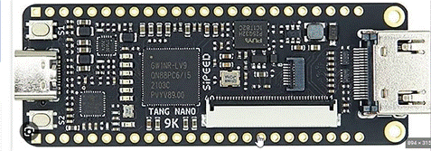
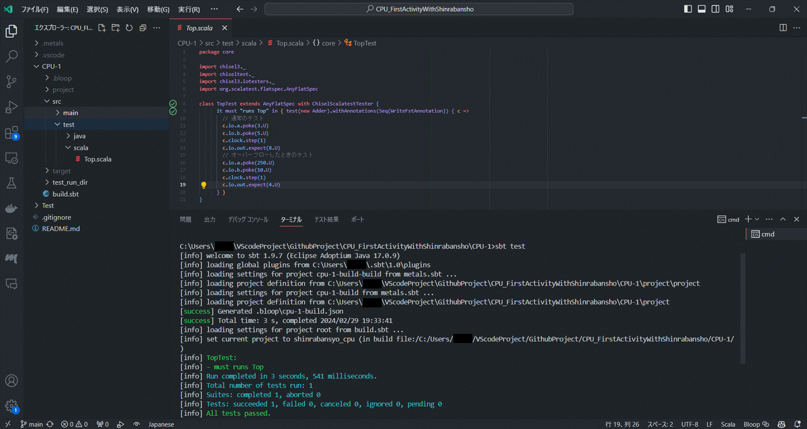
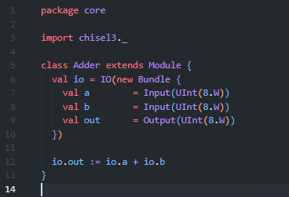
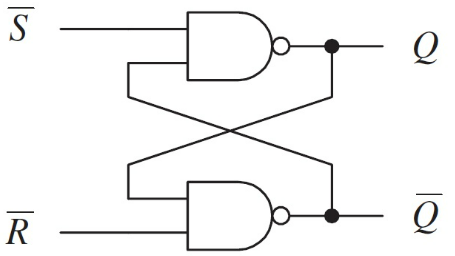
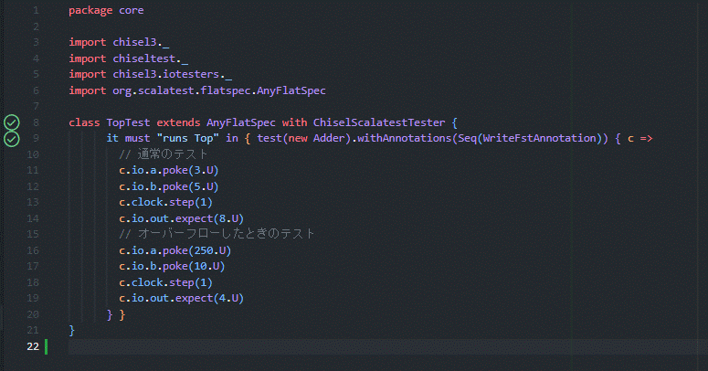
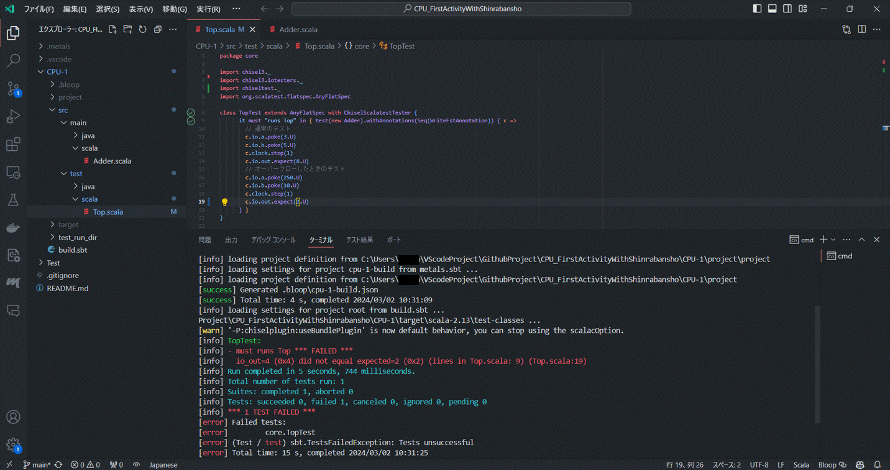

こんにちは！森羅万象プロジェクトです！

今回は **足し算だけできるCPU（の一部）** を作っていきたいと思います。  
  
（定期宣伝）  
ちなみにこの記事は、  
**CPUを作ったことのない人の、**  
**CPUを作ったことのない人による、**  
**CPUを作ったことのない人のための記事**  
ですので、CPU入門・初心者の筆者と一緒に勉強していただけたらと思っています！！
  
  
今回は、「加算器（Adder）」について、  
**1.加算ができるモノ ≒ 低機能CPU？**  
**2.足し算プログラムなんて作ったことあるよ？**  
**3.物理的に足し算ができるCPUを作りたい！**  
**4.加算器をChiselでつくってみた！**
に分けて説明していきます。

# 1.加算ができるモノ ≒ 低機能CPU？  
・CPUに必要なパーツについて、ChatGPTに聞いてみた（ものを要約した）ところ、以下のような要素があるとのことでした。  
  
1. **演算処理ユニット（Arithmetic Logic Unit, ALU）**  
   - 数値演算: 加算、減算、乗算、除算などの基本的な算術演算を実行。  
   - 論理演算: AND、OR、NOT、XORなどのビット単位の論理演算を行う。  
   （これらは全部NANDを組み合わせるだけでできる。NAND最強。）
  
2. **制御ユニット（Control Unit, CU）**  
   - 命令の解釈: プログラムから読み込んだ命令を解釈し、何を行う必要があるかを判断。  
   - 命令の実行: 各種装置に対して命令を送り、実行を管理。  
  
3. **レジスタ**  
   - 一時的なデータ保持: 処理中のデータや中間結果を一時的に保持。  
   - 特定の機能を持つレジスタ: 命令ポインタ、ステータスレジスタなど。  
  
4. **キャッシュメモリ**  
   - 高速アクセス: 頻繁に使用されるデータや命令を一時的に保持し、高速なアクセスを可能にする。  
  
5. **バスインターフェースユニット**  
   - データ転送: CPUとメモリや他のデバイス間でデータを転送。  
  
6. **命令セットアーキテクチャ（ISA）**  
   - 命令セット: CPUが理解できる命令のセット。このセットに基づいてプログラムはCPUに命令を出す。  
  
7. **パイプライン処理**  
   - 同時実行: 複数の命令を同時に処理することで、効率的な実行を実現。  
  
8. **クロックとタイミング**  
   - システムクロック: CPUの処理速度を決定するタイミング信号。  
  
- しかし、CPUの機能を全て個人で実装するにはノウハウや時間が足りない人も多いでしょう（作ったことない人でばなおさら）。ここでよく言われるのが、「足し算ができるCPUを作成できれば、それは究極的に機能を制限したCPUといえる」という話で、上の1.を作成しているとはいえるかもしれません。  
- いきなりメモリ機能やクロック機能を作れと言われてもできる気がしない（？）し、開発の時に「とりあえず動作確認のために加算器を作ろう」という流れになったというメタ的な事情もありますので、今回は加算器を作成していきます（ということで納得してください、、）。  
  
# 2.足し算プログラムなんて作ったことあるよ？  
- 「足し算できるモノを作ってください」と言われたら、PythonやJavaでも作れます（筆者も大学講義でC言語とJavaやりました）。    
``` 
# Python
class Adder:
    def __init__(self, a, b):
        self.a = a
        self.b = b

    def execute(self):
        return self.a + self.b

# 使用例
adder = Adder(3, 5)
print(adder.execute())
```   
``` 
// Java
public class Adder {
    private int a;
    private int b;

    public Adder(int a, int b) {
        this.a = a;
        this.b = b;
    }

    public int execute() {
        return this.a + this.b;
    }
}

// 使用例
Adder adder = new Adder(3, 5);
System.out.println(adder.execute());
```  
そこで、**ChiselというDSL**の出番なわけです。  
ScalaはJavaベースなので、パッと見はJavaと同じように見えます。
```
// Scala
class Adder(a: Int, b: Int) {
  def execute(): Int = {
    a + b
  }
}

// 使用例
val adder = new Adder(3, 5)
println(adder.execute())
```  
そして、ChiselはScalaのDSLなので、Scalaのコードを書くように見えます。  
```
// Chisel
class Adder extends Module {
  val io = IO(new Bundle {
    val a   = Input(UInt(8.W))
    val b   = Input(UInt(8.W))
    val out = Output(UInt(8.W))
  })

  io.out := io.a + io.b
}

// 使用例
val adder = Module(new Adder)
adder.io.a := 3.U
adder.io.b := 5.U
printf("%d\n", adder.io.out)
```  
 
PythonやJava、Scalaはソフトウェアを作成するためのプログラミング言語なので、実行するとソフトウェアができます。Chiselはハードウェアを作成するためのプログラミング言語なので、実行するとハードウェアができます。ハードウェアを作成するための設計図（[FIRRTL](https://github.com/chipsalliance/firrtl)?）を作り出し、それを用いたハードウェア設計を実行できる言語（[Verilog](https://en.wikipedia.org/wiki/Verilog)など）でハードウェアが作成されます。  
  
# 3.物理的に足し算ができるCPUを作りたい！
- せっかくなら物理的に足し算ができるCPUが欲しいですが、いきなり基盤に銅線を用意したり、はんだ付けをするのはハードルが高すぎます。（[セキュリティ・キャンプ](https://www.ipa.go.jp/jinzai/security-camp/about.html)でははんだ付けするゼミがありましたよ！！）  
- 今回のプロジェクトでは**FPGA（Field Programmable Gate Array）**（写真のようなもの）を使った物理CPUを作成します。
  - FPGAにはあらかじめ基盤に必要な回路やパーツがこれでもかと用意されています。これでもかと用意されているので、必要な回路やコンポーネントは自分で選ぶ必要があります。
  - Chiselで作成した「設計図」を書き込むことで、 **LUT（Look Up Table）** を書き換えることができます。LUTは、入力に対して出力を決定するためのテーブルのようなもので、真理値表のようなものと考えると分かりやすいかもしれません。  
 
  - このLUTを書き換えることで、FPGA上の回路を変更することができ（いろんなものが搭載されているFPGAの好きな部分だけ取ってきてつなげることができ）、最終的にCPU（の機能を持った物理ユニット）になるというわけです。  
  


# 4.加算器をChiselでつくってみた！  
サンプルコード：[筆者のGitHub](https://github.com/Astalisks/CPU_FirstActivityWithShinrabansho)
　　
### これが動けばOK！！  
  
  
  
とりあえず、サンプルコードをgit cloneしてきて、CPU-1中でtestが動けばOKです。  
できる方はどんな手を使ってもよいので、どうぞ。


### 筆者はこうやりました
  
（参考までに、筆者はWindows11を使っています。　上手くいかない場合はインターネットや友人に相談してみてくださいね。）
  
1. Adder.scalaをChiselで書く  
  
   
  
```  
package core

import chisel3._
// Javadだと import java.util.* 、  
// Pythonだとfrom module import *みたいな感じですね  
  
// ModuleはChiselの基本的なクラス（IOやBundleなどの便利関数を持ってる）  
class Adder extends Module {  
   // IOは入出力を定義するためのクラス  
   // Bundleは複数の信号をまとめるためのクラス  
   val io = IO(new Bundle {  
      // CPU（今回はFPGA）は0,1を保持しておくもの（トランジスタで作られたフリップフロップ）をいっぱい持ってます  
      // そのうちの8個(とそれぞれにつながる導線＆動線、だからW(idth)型)をaとして割り振る（b, outも同様）、という意味です
      // この8個のフリップフロップのカタマリを、a「レジスタ」と呼んだりします  
      val a        = Input(UInt(8.W))  
      val b        = Input(UInt(8.W))  
      val out      = Output(UInt(8.W))  
  })  
  // 8個の0,1では2の8乗（256）通りの組み合わせがあるので、0-255までの数値を表現できます  
  // なので大きい数を足し合わせると、、？（あとでやります）    
  io.out := io.a + io.b  
}  
```  
  
  
筆者の個人的ポイント：  
- 今回は「値を保存するもの」を物理的に用意しているのではあって「値」を入れているわけではありません。ソフトウェア記述言語ではよく「値が保存される」という説明を受けますが、裏では「値を保存するための場所」を物理的に（自動的に）用意しています。
- ちなみにフリップフロップに電気信号を送る際は「0（電圧をかけない）で」「出力1」を表示するケースがあります。ソフトウェアで「0 を代入すると 0 になる」というイメージとは逆かもしれません。  
  
  
  
2. Top.scala（Adder.scalaをテストするやつ）をChiselで書く  
  
  
  
（インポート部分で何ができるか詳しく知りたい方は、[公式github](https://github.com/chipsalliance/chisel)や
[org.scalatest.flatspec](https://www.scalatest.org/scaladoc/1.8/org/scalatest/FlatSpec.html)などをご確認ください）  
```  
package core  
  
// テストに使用するやつもインポート    
import chisel3._  
import chiseltest._  
import chisel3.iotesters._  
import org.scalatest.flatspec.AnyFlatSpec  
  
// Chiselのテストをするとき、ScalaTestとChiselScalatestTester（ScalaTestと組み合わせてChiselのモジュールをテスト）の機能を使う  
class TopTest extends AnyFlatSpec with ChiselScalatestTester {  
  
   // it must "runs Top" ≒ テストのゴール：Topが最後まで動くこと  
   // test(new Adder) ≒ Adderモジュールのインスタンスをテスト  
   // withAnnotations(Seq(WriteFstAnnotation)) ≒ FST（Fast Signal Trace）ファイルに波形データを書き出すためのアノテーションを追加  
   it must "runs Top" in { test(new Adder).withAnnotations(Seq(WriteFstAnnotation)) { c =>  

      // pokeで入力を与える、今回なら8個のフリップフロップ（のレジスタa）の内、下位2ビット分に電気信号を与えて1の状態にする（00000011 （2進数） ≒ 3（10進数））
      // peek（今は使ってませんが）で現在の状態を確認、確認するだけで間違いを指摘するわけではない  
      // expectで出力を検証、こっちは確認して間違ったら指摘してくれる

      // c.clock.step(1) で1クロック進める、poke, peek, expectは時間が止まった状態で行われるので、stepさせて（時間を進めて）初めてシミュレーションが進む  
      // aにpoke、bにpokeを（1クロック進めて）反映させるイメージ  
        
      // 通常のテスト  
      c.io.a.poke(3.U)  
      c.io.b.poke(5.U)  
      c.clock.step(1)  
      c.io.out.expect(8.U)  
      // オーバーフローしたときのテスト  
      c.io.a.poke(250.U)  
      c.io.b.poke(10.U)  
      c.clock.step(1)  
      c.io.out.expect(4.U)  
   } }  
}  
  
```  
  
- 筆者の個人的ポイント：シミュレーション特有の時間管理は要チェックですね、、。オーバーフロー後に4が入るのは、
250（11111001）＋ 10（00001010）＝ （260（100000100）だけど8bitで表示できないので）4（00000100）  
というイメージです。ちなみにずっとU(nsigned) int（符号なし整数）でやってるのは、 int（符号付き整数）の計算バグが面倒だからです、、。  
  
3. 実行（sbt test）したらこんな感じ  
正しく動くと上と同じ、全部「passed」になります。  
  
250 + 10 = 「4」を「2」にしてみるとこんな感じ。ちゃんと「違う！！」って言ってくれます。  
  
  
  
　　
----------------  
  
**足し算できましたでしょうか？** この記事を見てもできなかった・内容がおかしい等あれば、コメントやX（Twitter）で教えていただけると嬉しいです！  
次回は、CPUのALU部分の続き、メモリやプログラムカウンタを用意していきます！  
  
