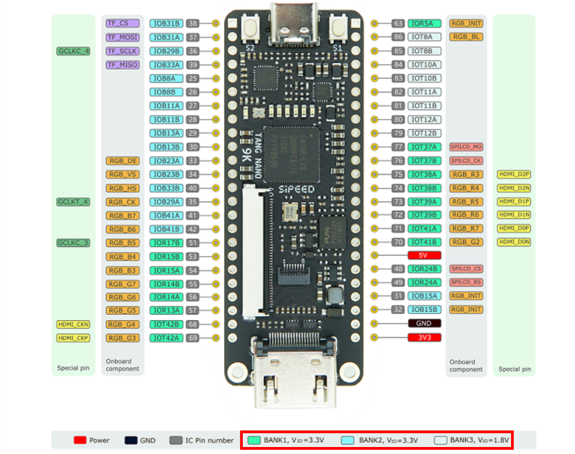
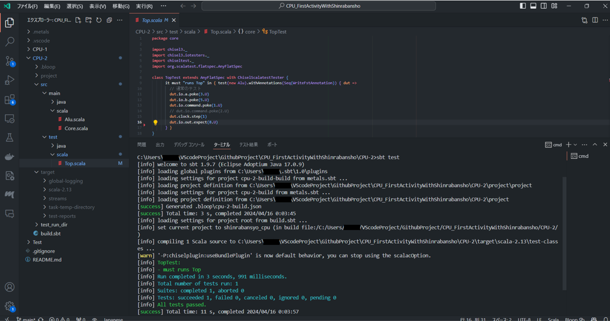
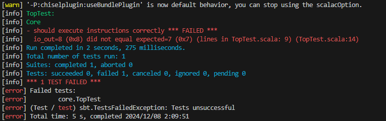

こんにちは！森羅万象プロジェクトです！  
  
今回は **足し算以外の他の命令もわかるCPU（の一部）** を作っていきたいと思います。  
  

（定期宣伝）  
ちなみにこの記事は、  
**CPUを作ったことのない人の、**  
**CPUを作ったことのない人による、**  
**CPUを作ったことのない人のための記事**  
ですので、CPU入門・初心者の筆者と一緒に勉強していただけたらと思っています！！
  
今回は「ALU（算術論理ユニット）」について、  
**1.ALUができたら足し算以外も「分かる」らしい、、**  
**2.命令を「分かる」ために必要な要素とは？**  
**3.そもそも、電気だけで命令をどう作っている？**  
**4.ALUをChiselでつくってみた！**
に分けて説明していきます。

# 1.ALUができたら足し算以外も「分かる」らしい、、  
・前回の記事では、CPUの機能の一部として  
  
1. **演算処理ユニット（Arithmetic Logic Unit, ALU）**  
   - 数値演算: 加算、減算、乗算、除算などの基本的な算術演算を実行。  
   - 論理演算: AND、OR、NOT、XORなどのビット単位の論理演算を行う。  
   （これらは全部NANDを組み合わせるだけでできる。NAND最強。）
  
という説明をしました。そして前回までの記事で「足し算だけできるCPU」を作成しました。しかし、足し算「だけ」でなく、引き算掛け算割り算、はたまたビットシフト（2乗とか）を行うとなると、「足し算か（そうでないか）を判別できるCPU」を作る必要があります。[Intel社のCPU](https://www.intel.com/content/www/us/en/developer/articles/technical/intel-sdm.html)や[AMD社のCPU](https://www.amd.com/content/dam/amd/en/documents/archived-tech-docs/datasheets/22529.pdf)は「1bitから15bitの命令を判別できるCPU」であるそうですが、それよりは「10bit固定の命令を判別できるCPU」を作る方が簡単な印象をもちます。そこでなんと「32bitの命令を判別できるCPU」の作成経験があるメンバーがいて、今回はその方のノウハウを参考に作業を進めることになりました。
  
少し脱線しますが、[セキュリティキャンプ](https://www.security-camp.or.jp/index.html)でグループワークの活動や個人の活動を続けたところ、3月に[セキュリティキャンプアワード](https://www.security-camp.or.jp/event/awardreport.html)で発表する機会をいただきました！！また、同時に[セキュリティ・キャンプフォーラム](https://www.ipa.go.jp/jinzai/security-camp/2024/forum2025.html)が開催されます！キャンプ参加者の発表以外にもためになる講演やトークショーがあります。一般の方も申し込みで聴講可能なので、ぜひ機会があればご参加ください（ついでに当プロジェクトのフィードバックもお待ちしています！！）  
  

# 2.命令を「分かる」ために必要な要素とは？  
CPUを作るにあたって、命令を「分かる」ために必要な要素を考えてみます。  
    
- まず、「足し算をする」という命令と「引き算をする」という命令を見分けるには、足し算を命令1, 引き算を命令2としておけばよさそうです。  
（CPU（内のレジスタ）は0か1の二値しか保持できないので、命令001と命令010（２進数）にして見分けておきます。）  
  
- 足し算引き算だけじゃなく、プログラムを少し勉強するとif文みたいなのが出てきます。「加算減算でない別種の命令」が必要という感じですね。  
（if文みたいなものを1-1, 足し算を（if文とは別種の計算として）2-1, 引き算を（足し算と似てる計算ということで）2-2として、2進数で001-001、010-001、010-010という風に書いておきます。）  
  
- 命令を出すとなったら、出した命令の順番を覚えてお区必要がありそうです。順番・時系列を「カウント」しておくものを用意します。  
（１回目が足し算、３回目が引き算なら、01:010-001、11:010-010、みたいな感じ。）  
  
- 足し算や引き算をしたら、結果を保存する必要があります。「メモリ」にデータを保存し、メモリが格納されている番地のようなもの（アドレス）が宛先として指定可能である、という授業を受けた人もいるかもしれません。また、命令をカウントするには命令そのものも保存しておく必要があります。  
（メモリは市販PCで8GBとか16GBとか言われるくらいなので、今回は（2^8 = 256 ≒ 命令256種類以下ならレジスタは8つあればよい ≒ レジスタは8192つもいらないはずなので）考慮しなくてよいほどめっちゃ大きくて命令は全部保存できるとしましょう。）  
  
- CPUのレジスタで保存できる量はメモリより少ないもの、爆速で計算可能です。（主記憶と補助記憶、トランジスタとキャパシタ、SRAMとDRAMとかが関係していますね。）  
「１回目」に、「レジスタ３」に入っている3と、「レジスタ５」に入っている5を「足し」て、結果を「レジスタ７」に入れるとするなら、01:010-001-011-101-111、と表せますでしょうか。）  
  
- x=3, y=5にしておいてからx+y=8にしてるなら、3とか5とかの「値そのものを保存する場所」がないといけません。
「１回目」に、「レジスタ３」に入っている3に「5」を「足し」て、結果を「レジスタ６」に入れるとするなら、その命令は01:010-001-011-101-110、などと表せそうです。
ということは、値を保持する場所は2～3個必要で、値そのもの（を置く場所）は0～1個必要そうですね。）  

- 0,1だけで命令を作ってるので、1bitでもズレたらヤバそうです。「命令全体は○○bit」と決めると、さっきの命令が010-001-011-101-111とか010-001-011-101-110なので「命令は15bit固定」と決めておく必要がありますね。（1bit左にずらして100-010-111-011-110とかになったら、違う命令に、、。）  
  
これらをまとめると、  
- 命令を管理するものとして「カウントするもの」「メモリの容量」は用意しておく
- 命令そのものに必要な要素を用意する
  - 「全体の長さ」
  - 「命令を大きく分類」
  - 「似た命令をさらに分類」
  - 「値を持っておくレジスタ×2～3個」
  - 「値そのもの×0～1個」  

これらがあれば、命令を正しく理解できそうですね。    
（見落としたもの・不要なものはないんですか？という意見もあるかもしれませんが、今のところはちゃんと必要十分になってます。今のところは、、。）  
  
# 3.そもそも、電気だけで命令をどう作っている？
[基本情報技術者試験](https://www.ipa.go.jp/shiken/kubun/fe.html)（←CBTなのでいつでも受けれるのでどうぞ！）を受ける方とか、音楽・CDとかに詳しい方であれば、標本化・量子化・符号化は聞いたことあるかもしれません。先の2.で01（２進数）を使ったのですが、そのbitに0か1を表示するときも同じで、閾値2.5V（FPGA「Tang nano 9K」はUSB接続だから5Vなので）より下だったら0、2.5Vより上だったら1といった表現ができます。[Tang nano 9Kの公式サイト](https://wiki.sipeed.com/hardware/en/tang/Tang-Nano-9K/Nano-9K.html)より引用し（て少し手入れし）たものを見ると、  
  
  

Tang nanoはUSBの5V電源から3つの直流電源を生み出すことができ、  
  
  
  
電圧はそれぞれ3.3V, 3.3V, 1.8Vになってるようですね。  
つまり、このFPGAは閾値が（3.3Vの半分の）1.65Vより下だったら0,   
上だったら1,とかをやってい（ると思い）ます。  
で、その3.3Vやら1.8Vやらを使って、USBもHDMIも使えるようになっている（いい感じに裏で実装されている）みたいですね。  
  
ちなみに、PCの電源もやっていることはほぼ同じで、ピーク時±141V交流（fromコンセント）から、500～1200W直流（デスクトップPC）、または90～250W直流（ノートPC）に変換します。そこからいくつかの12V（for CPU, GPU）とか5V（for USB, SSD）とか3.3V（for RAM, 他のチップ）を作ってくれてる（はず）です。  
  
# 4.ALUをChiselでつくってみた！  
サンプルコード：[筆者のGitHub](https://github.com/Astalisks/CPU_FirstActivityWithShinrabansho)  
今回はリポジトリ：CPU-2でやってます。  
  
### これが動けばOK！！  
  
  
  
とりあえず、サンプルコードをgit cloneしてきて、CPU-2中でtestが動けばOKです。  
できる方はどんな手を使ってもよいので、どうぞ。  
  
- 筆者の個人的ポイント：実はChiselに必要なJavaの環境が使えるか確かめるプログラムを少し変えてみました。まあ、ほとんどGPT生成なのですが、、。  
  
### 筆者はこうやりました
  
（参考までに、筆者はWindows11を使っています。上手くいかない場合はインターネットや友人に相談してみてください（定期）。）

  
1. Alu.scalaをChiselで書く  
  
```  
package core

import chisel3._
// ↓ココだけ追加
import chisel3.util._

class Alu extends Module {
  val io = IO(new Bundle {
  // command, a, b, outを定義します。
  // 先ほどのTang nano 9Kの図を見ると、周囲に丸いもの（I/Oピン）が48つあるのですが、  
  // （割り当て可能だがどうせそのうちI/Oピンを使うものが増え場所をズラしたりするので）
  // 48つのうちどこかに4つにそれぞれcommand, a, b, outが割り振られているイメージですね。
    val command  = Input(UInt(5.W))
    val a        = Input(UInt(32.W))
    val b        = Input(UInt(32.W))
    val out      = Output(UInt(32.W))
  })

  // Chiselのマルチプレクサ（多路選択機）→いくつかの回路を用意し1つを選んで通れるようにするもの
  // 今回のものであれば、デフォルトのルートは0（符号なし32bit）で、
  // commandが1（符号なし8bit）のときはa（符号なし32bit）とb（aと同じ）を足す、という感じですね。
  // 次回の記事で詳細を説明しますが、足し算が2種類ある理由として、
  // １．「レジスタA」の値aと「レジスタB」の値bを足す
  // ２．「レジスタA」の値aに「値（即値）」bを足す
  // という２種類があるからです。
  io.out := MuxCase(0.U(32.W), Seq(
    (io.command === 1.U(5.W)) -> (io.a + io.b),
    (io.command === 2.U(5.W)) -> (io.a + io.b),
  ))
}

```  
  
  
- 筆者の個人的ポイント：aとかoutとかには数値が入っているのではなく、あくまでも「数値が入る場所」を定義しています。「数値そのもの」が入っているわけではありません。筆者はこの原理を理解して記事を書くのに5カ月かかっているので、すぐイメージできる人はすごいかも、、。  

  
2. Core.scalaをChiselで書く  
  
```  
package core

import chisel3._
import chisel3.util._

// 前回はテストで直接メモリに値を入れていましたが、今回はファイルから読み込むようにします。
import chisel3.util.experimental.loadMemoryFromFile

class Core extends Module {
 
  // 「メモリの容量」は1024 * 6（6KB）で、「カウントするもの」は32bitで用意。
  val mem = Mem(1024 * 6, UInt(8.W))

  // CPU-2/src/main/resources/のファイルを置いておきます。
  loadMemoryFromFile(mem, "src/main/resources/bootrom.hex")

  // 実行する命令の位置を保持しておくためのレジスタ（プログラムカウンタ）を用意。
  val pc = RegInit(0.U(32.W))

  // 命令そのものに関して、
  //「全体の長さ」は48bit（6Byte）、
  //「命令を大きく分類」は5bit、
  //「似た命令をさらに分類」は3bit、
  //「値を持っておくレジスタ×2~3個」は5bit、
  //「値そのもの×0~1個」は32bitで用意。
  val instr      = Wire(UInt(48.W))
  val opcode     = Wire(UInt(5.W))
  val opcode_sub = Wire(UInt(3.W))
  val rd         = Wire(UInt(5.W))
  val rs1        = Wire(UInt(5.W))
  val rs2        = Wire(UInt(5.W))
  val imm        = Wire(UInt(32.W))

  // Fetch
  // カウントから6byte（48bit = instr）分の命令を読み込む
  // 今回はCPU-2/src/main/resources/bootrom.hexを6行ずつ読み込む
  instr := Cat(
    (0 until 6).map(i => mem.read(pc + i.U)).reverse
  )

  // Decode
  // 読み込んだものを上で用意した形に分ける
  opcode     := instr( 4,  0)
  opcode_sub := instr( 7,  5)
  rd         := instr(12,  8)
  rs1        := instr(17, 13)
  rs2        := instr(22, 18)
  imm        := instr(47, 16)


  // レジスタファイルの定義と初期化
  // 増やすと値をたくさん保持できる・メモリアクセス頻度が減るなどもメリットに加えて、
  // 回路が複雑になりレイテンシが増加するデメリットもついてきます。
  // 本質からそれてしまうのでとりあえずRISC-V系と同じ32個に、、。
  val regs = RegInit(VecInit(Seq.tabulate(32) { i => 0.U(32.W) }))

  // ALUのインスタンス化
  val alu = Module(new Alu)
  alu.io.command := opcode
  alu.io.a := regs(rs1)
  alu.io.b := MuxCase(0.U(32.W), Seq(
    // １．「レジスタA」の値aと「レジスタB」の値bを足す
    // ２．「レジスタA」の値aに「値（即値）」bを足す
    // をここで分けていますね。
    (opcode === 1.U(5.W)) -> regs(rs2),
    (opcode === 2.U(5.W)) -> imm,
  ))


  // 書き戻し
  // ALUで計算した結果を「書き戻す（write-backする）」処理。
  // CPU内のレジスタに結果を保存しておくことで、後続の命令が結果を利用できるようになります。
  when(opcode === 1.U(5.W)) {
    regs(rd) := alu.io.out
  }
  when(opcode === 2.U(5.W)) {
    regs(rd) := alu.io.out
  }

  // Toptest（後述）用の出力
  io.out := regs(2)

  // プログラムカウンタの更新、6Byte（48bit）だから+6。
  pc := pc + 6.U
}
  
```  
  
- 筆者の個人的ポイント：
  - 適宜このプロジェクトの[（今のとこ）公式ドキュメント](https://github.com/shinrabansyo/spec/blob/main/spec.adoc)も見てみてくださいね。  
  - 先ほど １回目が足し算・３回目が引き算なら、01:010-001・11:010-010、といった感じとしたのですが、今回のプロジェクトでは  
  pc：opcode-opecode_sub-rd-rs1-rs2-imm、の順で命令を読み込んでいます。（詳細はCPU-2/src/main/resources/memo.txtにもあります。）  
  - 命令をメモリにロードする際、逆順（reverse）にしてるのは「リトルエンディアン」「ビッグエンディアン」が関係しています。  
    - ビッグエンディアン (Big Endian)→0x12345678 が、メモリに [12][34][56][78] のように格納される。  
    - リトルエンディアン (Little Endian)→0x12345678 が、メモリに [78][56][34][12] のように格納される。  
  - 今回は「リトルエンディアン」を採用しているのですが、今後「値だけ取り出す」などをしたい場合に下位bit（[78]とか[56]とか）だけを取り出して処理できる、イマドキのCPU（x86→Intel Core iシリーズ（AMD64→AMD Ryzenシリーズ, ARM→Apple Mチップとか）が軒並みリトルエンディアンを採用している、などの理由があります。  
  - なんで5bitだったり3bitだったりで分けているのか、ですが、、、これは経験則とか冗長させとこう、みたいなところがあるようです。ただ、色々な所で定められている「intは32bit整数」みたいな決まりに合わせたくて即値（imm）は32bitにしたいという理由はありました。この辺りは、また別の記事にて、、。  
  
  
3. TopTest.scala（Alu.scalaをテストするやつ）をChiselで書く  
  
```  
package core

import chisel3._
import chiseltest._
import org.scalatest.flatspec.AnyFlatSpec

class TopTest extends AnyFlatSpec with ChiselScalatestTester {
  "Core" should "execute instructions correctly" in {
    test(new Core).withAnnotations(Seq(WriteVcdAnnotation)) { dut =>

      // 前回までは命令と値までこのテストで用意しましたが、
      // ・命令自体のテストはやってられない（48bit目視で確認はしんどい）
      // ・そのうち命令のテストをしなくてよくなる（コンパイラ・アセンブラ、、。）
      // ・命令はファイルから読み取るのが一般的である
      //　（import chisel3.util.experimental.loadMemoryFromFileがあるんだもん）
      // などの理由から、クロックと結果だけをここに書くようにします。
      // 1つの命令を読み込むのに1クロックを要するので、3命令で3サイクルですね。

      // クロックを3サイクル進める
      dut.clock.step(3)

      // 結果の検証
      dut.io.out.expect(8.U)
    }
  }
}


```  
  
  
4. 実行（sbt test）したらこんな感じ  
正しく動くと上と同じ、全部「passed」になります。expect(8.U)を「7」にしてみるとこんな感じ。ちゃんと「違う！！」って言ってくれます。  
  
  
  　　
----------------  
**足し算はできた（後まだ実装してないけど他の命令も実行できそう）でしょうか？**  
この記事を見てもできなかった・内容がおかしい等あれば、コメントやX（Twitter）で教えていただけると嬉しいです！  
  
次回は、足し算以外もできるよう、命令の追加をしていきます！  

