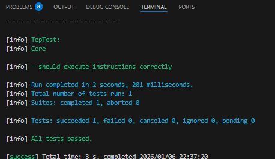
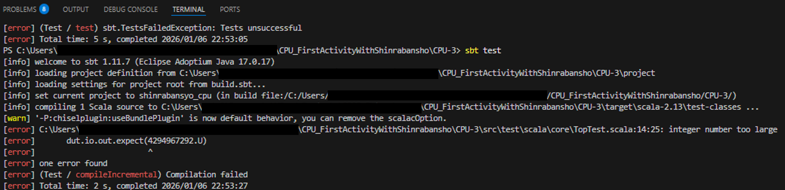
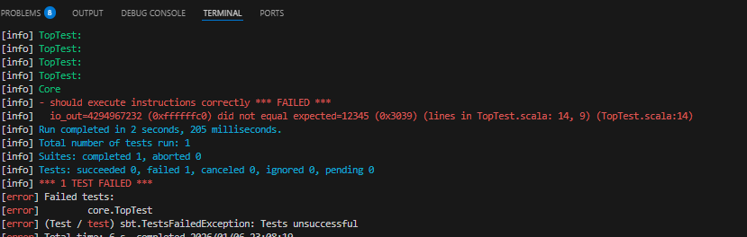

こんにちは！森羅万象プロジェクトです！


今回は **加算以外もできるCPU（その１）** を作っていきたいと思います。  
  
（定期宣伝）  
この記事は、  
**CPUを作ったことのない人の、**  
**CPUを作ったことのない人による、**  
**CPUを作ったことのない人のための記事**  
ですので、CPU入門・初心者の筆者と一緒に勉強していただけたらと思っています！！
  
  
今回は、CPUに必要な命令（の一部）を考えていきます。  
  
「CPUに送る・CPUが認識できる命令」について、  
**1.命令の種類について**
**2.CPUに必要な命令１：演算を行う命令**
**3.命令を追加してみた！**
に分けて説明していきます。
筆者的には、最もCPUを作っているなと実感した部分です！  

# 1.命令の種類について  
・前回の記事では、命令を構成する要素と、そのbit数について紹介しました。
- 命令を管理するものとして「カウントするもの（pc）」「メモリの容量（mem）」は用意しておく
- 命令1つの長さ（instr）は48bit
  - 命令の種類を5bitで大きく分類（opcode）
  - さらに3bitをつかって命令を細かく分類（opcode_sub）
  - 値を持っておくレジスタ（rd, rs1, rs2）は2~3個、原則5bit/個
  - 値そのもの（imm）は0~1個、原則32bit/個
  
また、前回のプログラムでは「opcode」や「rs1」などの変数を充てていますが、詳しい意味については[本プロジェクトのスペックシート](https://github.com/shinrabansyo/spec/blob/main/spec.adoc)をご確認ください！  

  
・さて、これまでの取り組みでは「命令を受け取り、処理ができるCPU」を作成しました。今回の記事からは数回は、「CPUへわたす命令」を考えていきます！！（プロジェクト開始時何も知らなかった筆者は、CPUは命令を考えていくところから始まると思っていたのですが、まさか3記事も作成できるくらい下準備があるとは思っていませんでした、、。）  
  
・まず、前回までの記事で用意した「足し算命令」について確認します。  
- add命令  
  - 2つのレジスタの値を足して、結果を別のレジスタに格納する。  
  - 例：`add r1, r2, r3`  
    - r2の値と、r3の値を足して、r1に格納する。
  
- addi命令  
  - レジスタの値に即値を足して、結果を別のレジスタに格納する。  
  - 例：`addi r1, r2, 3`  
    - r2の値に、値3を足して、r1に格納する。

単に足し算だけでも、「指定したレジスタの値同士を足し算する」命令と、「指定したレジスタの値に数値そのものをパスして足し算する」命令の2種類の命令があります。  
もっと抽象的にいうと、「レジスタとレジスタの結果をレジスタに保存する」形式と、「レジスタと値から処理を行い、それをレジスタに保存する」形式の2形式があると説明できます。  
  
・結論からになりますが、（本プロジェクトでは）CPUにわたすことのできる命令には他に2形式あります。  
1つは「特に計算とかはせず、値をそのままどこかへ書き込む」形式です。メモリで計算した後、別のメモリやレジスタにデータを保存したり、映像出力など外部のデバイスに書き込むような操作を指します。先述した（mem）はこの命令を定義するために必要不可欠な要素です。  
もう一つは「条件によって処理が分岐する」形式です。CやPythonなどのソフトウェア言語を学んだ方であれば、if文のように分岐すると考えるとよいかもしれません。命令1が分岐命令の時、条件に合致していれば命令2を、していなければ命令3を処理する、のような操作を指します。先述した（pc）はこの命令を定義するために必要不可欠な要素になります。  
  
・以上の4形式の命令は取り上げた順に、「R（レジスタ）形式」、「I（イミディエイト）形式」、「S（ストア）形式」、「B（ブランチ）形式」と呼んでいます。これらも、先述したスペックシートで詳しく定義されていますので、ぜひご一読ください！  
  
・とはいっても、形式ごとに若干実装が異なるため、今回は始めに取り上げたR形式とI形式の命令形式を用いた「演算を行う命令」を紹介していきます！！
  
  
# 2.CPUに必要な命令１：演算を行う命令  
  
・足し算があれば、引き算もありますね。似たような感じで用意します。  
  
- sub命令  
  - 2つのレジスタの値を引いて、結果を別のレジスタに格納する。  
  - 例：`sub r1, r2, r3`  
    - r2の値から、r3の値を引いて、r1に格納する。

- subi命令  
  - レジスタの値から即値を引いて、結果を別のレジスタに格納する。  
  - 例：`subi r1, r2, 3`  
    - r2の値から、値3を引いて、r1に格納する。

・加算減算以外にも、論理演算は似た形式で用意できます。AND、OR、XORなどです。

- and命令  
  - 2つのレジスタの値で論理積を取り、結果を別のレジスタに格納する。  
  - 例：`and r1, r2, r3`  
    - r2の値と、r3の値で論理積を取り、r1に格納する。
  
- andi命令  
  - レジスタの値と即値で論理積を取り、結果を別のレジスタに格納する。  
  - 例：`andi r1, r2, 3`  
    - r2の値と、値3で論理積を取り、r1に格納する。

- or命令  
  - 2つのレジスタの値で論理和を取り、結果を別のレジスタに格納する。  
  - 例：`or r1, r2, r3`  
    - r2の値と、r3の値で論理和を取り、r1に格納する。

- ori命令
  - レジスタの値と即値で論理和を取り、結果を別のレジスタに格納する。  
  - 例：`ori r1, r2, 3`  
    - r2の値と、値3で論理和を取り、r1に格納する。

- xor命令
  - 2つのレジスタの値で排他的論理和を取り、結果を別のレジスタに格納する。  
  - 例：`xor r1, r2, r3`  
    - r2の値と、r3の値で排他的論理和を取り、r1に格納する。

- xori命令
  - レジスタの値と即値で排他的論理和を取り、結果を別のレジスタに格納する。  
  - 例：`xori r1, r2, 3`  
    - r2の値と、値3で排他的論理和を取り、r1に格納する。

・また、ビットシフト演算も似た形式で用意できます。論理左シフト、論理右シフト、算術右シフトなどです。

- srl命令
  - 2つのレジスタの値で論理右シフトを行い、結果を別のレジスタに格納する。  
  - 例：`srl r1, r2, r3`  
    - r2の値を、r3の値分だけ論理右シフトし、r1に格納する。

- srli命令
  - レジスタの値と即値で論理右シフトを行い、結果を別のレジスタに格納する。  
  - 例：`srli r1, r2, 3`  
    - r2の値を、値3だけ論理右シフトし、r1に格納する。

- sra命令
  - 2つのレジスタの値で算術右シフトを行い、結果を別のレジスタに格納する。  
  - 例：`sra r1, r2, r3`  
    - r2の値を、r3の値分だけ算術右シフトし、r1に格納する。

- srai命令
  - レジスタの値と即値で算術右シフトを行い、結果を別のレジスタに格納する。  
  - 例：`srai r1, r2, 3`  
    - r2の値を、値3だけ算術右シフトし、r1に格納する。

- sll命令  
  - 2つのレジスタの値で論理左シフトを行い、結果を別のレジスタに格納する。  
  - 例：`sll r1, r2, r3`  
    - r2の値を、r3の値分だけ論理左シフトし、r1に格納する。

- slli命令
  - レジスタの値と即値で論理左シフトを行い、結果を別のレジスタに格納する。  
  - 例：`slli r1, r2, 3`  
    - r2の値を、値3だけ論理左シフトし、r1に格納する。

# 3.命令を追加してみた（その１）！  
サンプルコード：[筆者のGitHub](https://github.com/Astalisks/CPU_FirstActivityWithShinrabansho)  
今回はリポジトリ：CPU-3でやってます。  

サンプルコードをcloneしてきて、CPU-3中でsbt testが動けばOKです。  
が、命令ごとにテストファイルと出力が異なるので、以下を参考に試してみてください。

### テストを構成する要素について
src/main配下の、重要なディレクトリ・ファイルは以下の4点になります。

1. src/main/scala/core/Alu.scala  
  - ALU（算術論理演算装置）を定義するファイルです。命令ごとの演算処理をここで定義します。  
```  
package core

import chisel3._
import chisel3.util._

class Alu extends Module {
  val io = IO(new Bundle {
    val command  = Input(UInt(8.W))
    val a        = Input(UInt(32.W))
    val b        = Input(UInt(32.W))
    val zero     = Output(Bool())
    val out      = Output(UInt(32.W))
  })

  io.zero := (io.out === 0.U(32.W))  // 出力が0のときに1になる信号

  io.out := MuxCase(0.U(32.W), Seq(
    // chisel(scala)だと、各演算は以下のように記述します。
    (io.command === 1.U(8.W)) -> (io.a + io.b),
    (io.command === 2.U(8.W)) -> (io.a - io.b),
    (io.command === 3.U(8.W)) -> (io.a & io.b),                      // and
    (io.command === 4.U(8.W)) -> (io.a | io.b),                      // or
    (io.command === 5.U(8.W)) -> (io.a ^ io.b),                      // xor
    (io.command === 6.U(8.W)) -> (io.a >> io.b(4, 0)),               // 右論理シフト
    (io.command === 7.U(8.W)) -> (io.a.asSInt >> io.b(4, 0)).asUInt, // 右算術シフト
    (io.command === 8.U(8.W)) -> (io.a << io.b(4, 0)),               // 左論理シフト
  ))
}

```  

2. src/main/resources内の各テスト用ファイル  
  - 1つのテストにつき、.hexファイルとmemo.txtファイル、output.txtファイルがセットになっています。
    - .hexファイルではテスト用の命令を格納しています。
      - 1命令は48bit = 6Byteなので、16進数で8bitずつ、6行に分けて記述します。
    - memo.txtファイルでは、テスト用の命令の説明を記述しています。
    - output.txtファイルでは、テスト実行後の出力例を表示しています。

3. src/main/scala/core/Core.scala  
  - CPUの中核を定義するファイルです。命令のデコードや、各パーツの接続をここで定義します。  
  - 2.で取り上げたmemo.txtファイルの説明を参考に、Core.scala内のコードを一部修正してください。
```
※pickupして説明します

import ~~

class Core extends Module {

// I形式では、rs1が即値として使われるため、rs1_iを用意しています。
// I形式のみ、5bitでなく、3bitでrs1を指定するため、上位2bitを0にしています。
// （48bitの命令の中に即値を32bitで指定したいがあまり、5bitまるまる確保することができませんでした、この件については追々、、。）
（略）
  val rs1        = Wire(UInt(5.W))
  val rs1_i      = Wire(UInt(5.W))
（略）
  rs1        := instr(17, 13)
  rs1_i      := Cat(0.U(2.W), instr(15, 13))


（略）

  // 命令はここで用意されます。
  // （森羅万象プロジェクトでは先にB形式, S形式も定義してしまったため、番号が飛んでopcode7, 8を使用しています。）
  val command = Wire(UInt(8.W))
  command := MuxCase(0.U(8.W), Seq(
    (opcode === 1.U(5.W) && opcode_sub === 1.U(3.W)) -> (1.U(8.W)), // add
    (opcode === 1.U(5.W) && opcode_sub === 2.U(3.W)) -> (2.U(8.W)), // sub

    (opcode === 2.U(5.W) && opcode_sub === 1.U(3.W)) -> (1.U(8.W)), // addi
    (opcode === 2.U(5.W) && opcode_sub === 2.U(3.W)) -> (2.U(8.W)), // subi

    // opcode === 3.U ~ 6.U は次回以降使用する

    (opcode === 7.U(5.W) && opcode_sub === 0.U(3.W)) -> (3.U(8.W)), // and
    (opcode === 7.U(5.W) && opcode_sub === 1.U(3.W)) -> (4.U(8.W)), // or
    (opcode === 7.U(5.W) && opcode_sub === 2.U(3.W)) -> (5.U(8.W)), // xor
    (opcode === 7.U(5.W) && opcode_sub === 3.U(3.W)) -> (6.U(8.W)), // srl
    (opcode === 7.U(5.W) && opcode_sub === 4.U(3.W)) -> (7.U(8.W)), // sra
    (opcode === 7.U(5.W) && opcode_sub === 5.U(3.W)) -> (8.U(8.W)), // sll

    (opcode === 8.U(5.W) && opcode_sub === 0.U(3.W)) -> (3.U(8.W)), // andi
    (opcode === 8.U(5.W) && opcode_sub === 1.U(3.W)) -> (4.U(8.W)), // ori
    (opcode === 8.U(5.W) && opcode_sub === 2.U(3.W)) -> (5.U(8.W)), // xori
    (opcode === 8.U(5.W) && opcode_sub === 3.U(3.W)) -> (6.U(8.W)), // srli
    (opcode === 8.U(5.W) && opcode_sub === 4.U(3.W)) -> (7.U(8.W)), // srai
    (opcode === 8.U(5.W) && opcode_sub === 5.U(3.W)) -> (8.U(8.W)), // slli
  ))

  // 実際の計算はここで宣言され、ALUに値が渡されALUで演算されます。
  alu.io.command := command
  alu.io.a       := MuxCase(regfile(rs1), Seq(
    // opcode === 1.U(5.W) はrs1を使用しない
    (opcode === 2.U(5.W)) -> (regfile(rs1)),                            // addi, subi
    // opcode === 3.U ~ 6.U は次回以降使用する
    // opcode === 7.U(5.W)はrs1を使用しない
    (opcode === 8.U(5.W)) -> regfile(rs1_i),                             // andi, ori, xori, srli, srai, slli
  ))
  alu.io.b       := MuxCase(0.U(32.W), Seq(
    (opcode === 1.U(5.W)) -> (regfile(rs2)),                              // add, sub
    (opcode === 2.U(5.W)) -> (imm),                                       // addi, subi
    // opcode === 3.U ~ 6.U は次回以降使用する
    (opcode === 7.U(5.W)) -> (regfile(rs2)),                              // and, or, xor, srl, sra, sll
    (opcode === 8.U(5.W)) -> (imm),                                       // andi, ori, xori, srli, srai, slli
  ))

  // 命令処理ごとの最終的な結果はここに格納されます。
  regfile(rd) := alu.io.out

  // デバッグ用の出力をここで行っています。output.txtファイルの内容と照らし合わせてみてください。
  printf(p"------pc    : 0x${Hexadecimal(pc)} ------\n")
  printf(p"instr       : 0x${Hexadecimal(instr)}\n")
  printf(p"opcode      : 0x${Hexadecimal(opcode)}\n")
  printf(p"opcode_sub  : 0x${Hexadecimal(opcode_sub)}\n")
  printf(p"rd          : 0x${Hexadecimal(rd)}\n")
  printf(p"rs1         : 0x${Hexadecimal(rs1)}\n")
  printf(p"regfile(rs1): 0x${Hexadecimal(regfile(rs1))}\n")
  printf(p"regfile(rs2): 0x${Hexadecimal(regfile(rs2))}\n")
  printf(p"imm         : 0x${Hexadecimal(imm)}\n")
  printf(p"command     : 0x${Hexadecimal(command)}\n")
  printf(p"alu.io.a    : 0x${Hexadecimal(alu.io.a)}\n")
  printf(p"alu.io.b    : 0x${Hexadecimal(alu.io.b)}\n")
  printf(p"alu.io.out  : 0x${Hexadecimal(alu.io.out)}\n")
  printf(p"-------------------------------\n\n")

  // テスト用の出力
  io.out := regfile(「テストに合わせて変更」)

  // プログラムカウンタの更新
  // カウントするもの（pc）が6ずつ増加するのは、2.で取り上げた1命令が6行で構成されているためです。
  pc := pc + 6.U
}

```

4. src/test/scala/TopTest.scala  
  - CPU全体のテストを定義するファイルです。Core.scala内で定義した命令が正しく動作しているかをここで確認します。  
  - 2.で取り上げたmemo.txtファイルの説明を参考に、TopTest.scala内のコードを一部修正してください。
```
package core

import chisel3._
import chiseltest._
import org.scalatest.flatspec.AnyFlatSpec

class TopTest extends AnyFlatSpec with ChiselScalatestTester {
  "Core" should "execute instructions correctly" in {
    test(new Core).withAnnotations(Seq(WriteVcdAnnotation)) { dut =>
      // ここでクロックを進め、命令を実行します。1命令につき6ステップ進める必要があります。ギアが6つある歯車を1回転させるイメージですね。
      dut.clock.step(「何命令おこなうかを指定」])

      // 6ステップ毎に、3.で用意したio.outに値が入ります（6ステップ毎に更新されていきます）。そのクロックで結果が正しいかをここで検証できます。
      dut.io.out.expect(「結果としてほしい値を宣言」.U)
    }
  }
}

```


### 実行（sbt test）時の注意 
適切にファイルを修正し、sbt testを実行することで、大抵の命令は動作確認ができます。

  

一部のoutput.txtファイルにも記載があるのですが、chiselはint型を32bitとして扱うため、期待する値を2147483648以上にした場合にエラーとなります。　　

  
  
その場合、値を適当に小さくし、再度sbt testの実行完了後のエラーで値が正常か確認してください。

  
  
----------------  
**命令を追加できましたでしょうか？**  
この記事を見てもできなかった・内容がおかしい等あれば、コメントやX（Twitter）で教えていただけると嬉しいです！  
  
次回は、分岐命令の追加をしていきます！  
