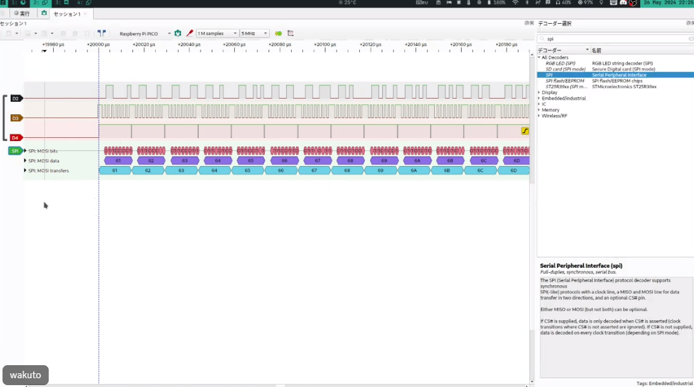

前の記事　[「00-02_自作の「レベル」とは」]([tech-blog/Articles/99-雑談・小ネタ集/99-02_最新の開発報告（ver.24年12月）/99-02_最新の開発報告（ver.24年12月）.md](https://github.com/shinrabansyo/tech-blog/tree/main/Articles/99-%E9%9B%91%E8%AB%87%E3%83%BB%E5%B0%8F%E3%83%8D%E3%82%BF%E9%9B%86/99-01_%E6%A3%AE%E7%BE%85%E4%B8%87%E8%B1%A1%E3%83%97%E3%83%AD%E3%82%B8%E3%82%A7%E3%82%AF%E3%83%88%E3%81%8C%E3%81%A7%E3%81%8D%E3%82%8B%E3%81%BE%E3%81%A7%E3%80%81%E3%80%81%E3%80%82))  


# 1.近況報告_Astalisks編

(担当: xxxx) 

あああ  
  

# 2.近況報告_Koonato編

(担当: SDカード) 

OS担当のkoonatoです！
「OSの森羅万象作るぞ！」というツイートを見かけて参画してから早数か月、OS完成までの道のりは遠いと感じる今日この頃ですが、着実に進めています。

本章では、SDカード周りの話をしたいと思います。

### レジスタとメモリの関係
森羅万象で作成しているCPUにはレジスタが32個あります。このレジスタは計算の要ですが、全てのデータや処理をこれだけで完結させるのは難しいです。というのも、各レジスタには役割があり、

- 一時的なデータ保存
- 関数の引数や戻り値の格納
といった用途ごとに使われます。このため、すぐに空きが足りなくなるのです。これを効率よく管理するために「レジスタスケジューリング」が必要になります。

### メモリ退避とSDカード
レジスタスケジューリングでは、空きが必要な場合に、レジスタの内容を一時的にメモリへ退避させます。ここで「メモリ」が登場します。プロジェクトではSDカードをメモリとして利用し、データを退避させたりロードしたりする仕組みを取り入れることにしました。

ただし、SDカードを利用するにはSPI（Serial Peripheral Interface）という通信方式を用いる必要があります。SPIはシンプルですが様々な箇所で使われる通信プロトコルで、4本の信号線（MISO, MOSI, SCLK, CS）を使いデバイス同士をつなげます。このプロジェクトではSPI操作をアセンブラで実装しました。テストプラグラムを動かしたのが下の波形です。


ちゃんと、プログラムした通りの波形が出力されているのがわかります。

### SPI操作とSDカード初期化
SPIを通じてSDカードを扱うには、まず初期化が必要です。以下の図はその手順を示しています。



この初期化プロセスでは、カードに複数のコマンドを送信し、SDカードとホスト（CPU）が適切に通信できる状態を整えます。初期化には

- SPIモードの設定
- クロック信号の送信
- 必要な待機時間の確保
など多くの作業が含まれます。これをアセンブラで1つずつ組み上げていきました。
以下が、その一例です。

```
// uint8_t func_sd_init(uint8_t cs, uint8_t clk_shamt)
@func_sd_init
    // プロローグ
    // フレームポインタの退避
    subi r2 = r2, 4
    sw r2[0] = r3
    addi r3 = r2, 0

    // リターンアドレスの退避
    subi r2 = r2, 16
    sw r3[-4] = r1
    sw r3[-8] = r20
    sw r3[-12] = r21
    sw r3[-16] = r22

    //////////////////////////////////////////////////////////////
    
    // 引数の保存
    add r20 = r0, r10   // cs
    add r21 = r0, r11   // clk_shamt

    //////////////////////////////////////////////////////////////
    
    // GPIO: io空間の0x04番地 32bit の値が入る
    // 0bit: GPIO0
    // 31: GPIO31
    
    // Gpio:Init
    add r10 = r0, r20
    addi r11 = r0, 1
    beq r1, (r0, r0) -> @func_gpio_write

    // Spi:Mode
    addi r4 = r0, 0
    out r0[2] = r4                  // Mode = 0

    // Spi:Clockshamt
    add r4 = r0, r11
    out r0[3] = r4                  // Clockshamt = 4
    // spiモードの初期化
    // チップセレクト

    //////////////////////////////////////////////////////////////

    // 1. 1ms待機
    addi r10 = r0, 0x01
    beq r1, (r0, r0) -> @func_wait_ms

    // 2. CS = High
    add r10 = r0, r20
    addi r11 = r0, 1
    beq r1, (r0, r0) -> @func_gpio_write

    // 3. DI = High & 74 クロック待機
    addi r4 = r0, 0
```

コード自体は今見ると意外とシンプルだったかもしれないです。ただ、実装は非常に大変でした。
特に私は、アセンブラをあんまり触ってきた経験が少なくほかの方に比べると、だいぶ苦戦しつつになりました。また、SDカードでは何ms待つといったルールが存在し、それを実現するには現状のタイマーだと足りない！ということになり急遽実装したりしていました。

森羅万象プロジェクトは、一筋縄ではいかない課題が次々と現れますが、ひとつひとつクリアしていく楽しさがあります。今回のSDカード実装を通して、ハードウェアとの連携の難しさと奥深さを改めて実感しました。これからも頑張って進めていきます！

# 3.近況報告_wakuto編

(担当: CPUまわり) 

あああ  


# 4.近況報告_yn0014編

(担当: デバッガ・コンパイラ) 
