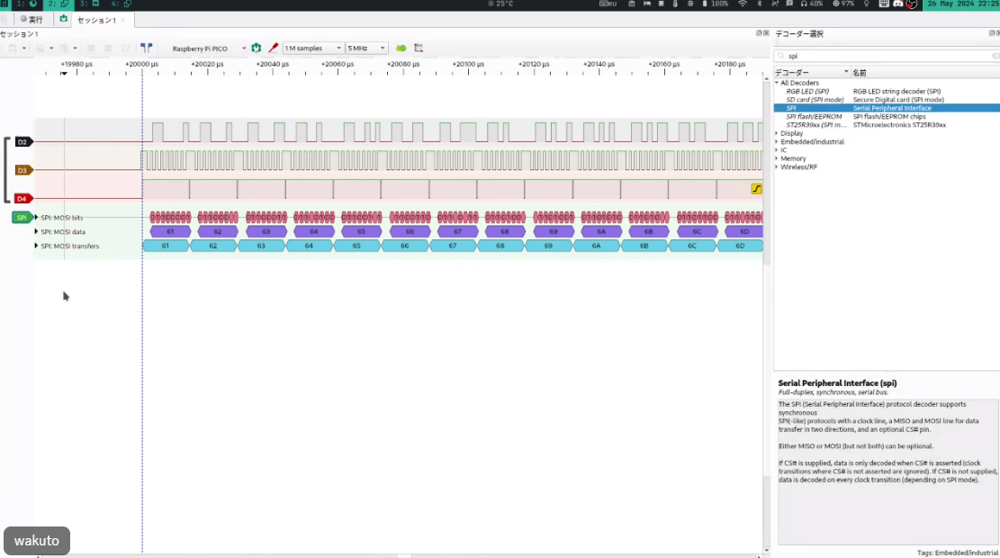
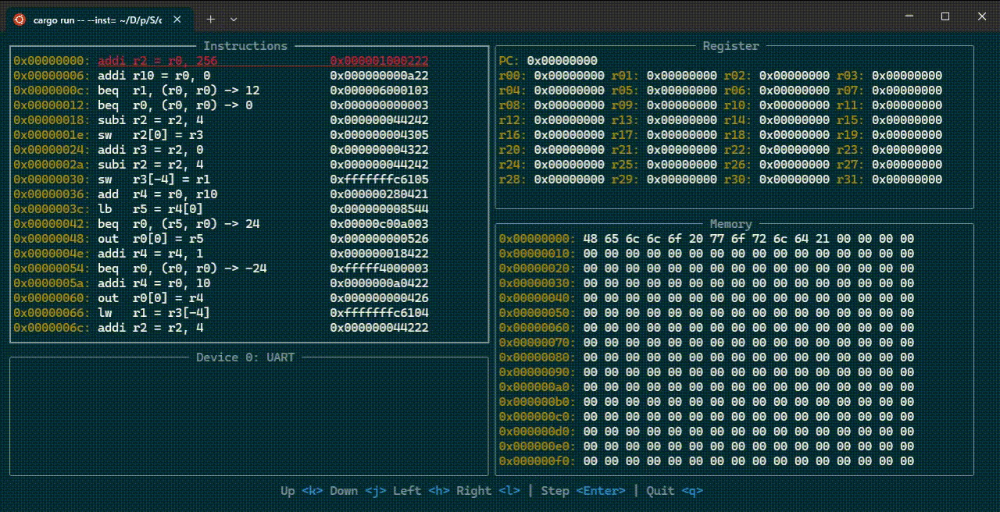

宣伝も含めて、メンバー4人それぞれが近況報告をしております！！  
普段の記事よりハイレベルな話も含まれているので、ぜひご覧ください！！  
  
# 1.全体の近況報告と記事について

記事担当のAstalisksです。  
いつも記事にてお話しているので、プロジェクトの説明や近況報告を  
簡単にしていきたいと思います。  

## 改めて、森羅万象プロジェクトとは？
「[セキュリティ・キャンプ全国大会2023](https://www.ipa.go.jp/jinzai/security-camp/about.html)」内のグループワークで結成されたグループで、  
2023年8月より週1（2~4時間ほどの）ペースで活動しております。  
**「なんでもかんでも自分で作れたら最強なのでは！？」**  
というコンセプトのもと、CPUから自作を始めています。  
2024年3月の[セキュリティ・キャンプアワード](https://www.security-camp.or.jp/event/awardreport.html)では、  
自作した世にも珍しい48bitCPUで「Hello World」を表示することに成功しました。  
今年の目標はSDカードを使えるようにすることで、アセンブリ規則の制定と実装を行い、  
最近ようやく動作かと思われたのですが、謎のエラーにつかまり（後述）、、。  
OSやネットワークに進めるのはもう少し先になりそうです、、。  
 
## 毎週mtgでの作業について、、。
基本的にモブプログラミングで進めています。  
1人が他の人のアドバイスの上でコードを書いていく形です。  
毎週の進捗はCosense（旧：Scrapbox）にまとめています。 
プログラミング経験がほとんどない私が最近開発をしていて気づいたことなのですが、 
歴戦プログラマーである他のメンバーと比べ、文法ミスをしてしまうことが  
圧倒的に多いと感じました。  
「そこは::が必要ですね」「kindでなくてKindですな」など、  
細かい部分がすぐ修正できる点は大変ありがたいのですが、  
「そこはAじゃなくてBを使いますね」と私が異なる変数を入れるたびに、  
プログラムの意味を理解できていないと痛感しました。  
1日1時間必ずAIを使わず（今は）Rustを書く時間を自分に設けて2カ月たちましたが、  
開いた差はなかなか埋まらなそうです、、。
  
## 記事について、、。
記事は基本的には自分が担当しています。  
初めは「CPU分からん私が記事書けるようになれば、初学者に優しい記事になるのでは！？」と  
思っていましたが、やはりCPUのについて私が理解しておらず、  
[前回の記事](https://github.com/shinrabansyo/tech-blog/tree/main/Articles/01-CPU%E3%82%92%E3%81%A4%E3%81%8F%E3%82%8D%E3%81%86%EF%BC%88%E3%81%84%E3%81%8D%E3%81%AA%E3%82%8A%EF%BC%81%EF%BC%9F%EF%BC%89/01-03_%E5%91%BD%E4%BB%A4%E3%82%92%E9%80%81%E3%82%8B%E3%83%BB%E5%8F%97%E3%81%91%E5%8F%96%E3%82%8B)については7カ月間違った挙動の記事を掲げてしまいました。  
記事の更新も遅く、大変申し訳ありません。  
ただ、日本における素人が書いた自作CPU記事という観点では唯一性があると考えており、  
このプロジェクト自体が何十年でも続くものであると私は確信しています。  
引き続き記事の投稿、過去記事のブラッシュアップを進めていきますので、  
長い目でみていただければと思います。よろしくお願いいたします。  
（是非フィードバックをコメントやX（Twitter）にて、、。）

  
# 2.SDカードについての近況報告

OS担当のkoonatoです！
「OSの森羅万象作るぞ！」というツイートを見かけて参画してから早数か月、OS完成までの道のりは遠いと感じる今日この頃ですが、着実に進めています。

本章では、SDカード周りの話をしたいと思います。

### レジスタとメモリの関係
森羅万象で作成しているCPUにはレジスタが32個あります。このレジスタは計算の要ですが、全てのデータや処理をこれだけで完結させるのは難しいです。というのも、各レジスタには役割があり、

- 一時的なデータ保存
- 関数の引数や戻り値の格納
といった用途ごとに使われます。このため、すぐに空きが足りなくなるのです。これを効率よく管理するために「レジスタスケジューリング」が必要になります。

### メモリ退避とSDカード
レジスタスケジューリングでは、空きが必要な場合に、レジスタの内容を一時的にメモリへ退避させます。ここで「メモリ」が登場します。プロジェクトではSDカードをメモリとして利用し、データを退避させたりロードしたりする仕組みを取り入れることにしました。

ただし、SDカードを利用するにはSPI（Serial Peripheral Interface）という通信方式を用いる必要があります。SPIはシンプルですが様々な箇所で使われる通信プロトコルで、4本の信号線（MISO, MOSI, SCLK, CS）を使いデバイス同士をつなげます。このプロジェクトではSPI操作をアセンブラで実装しました。テストプラグラムを動かしたのが下の波形です。


ちゃんと、プログラムした通りの波形が出力されているのがわかります。

### SPI操作とSDカード初期化
SPIを通じてSDカードを扱うには、まず初期化が必要です。以下の図はその手順を示しています。



この初期化プロセスでは、カードに複数のコマンドを送信し、SDカードとホスト（CPU）が適切に通信できる状態を整えます。初期化には

- SPIモードの設定
- クロック信号の送信
- 必要な待機時間の確保
など多くの作業が含まれます。これをアセンブラで1つずつ組み上げていきました。
以下が、その一例です。

```
// uint8_t func_sd_init(uint8_t cs, uint8_t clk_shamt)
@func_sd_init
    // プロローグ
    // フレームポインタの退避
    subi r2 = r2, 4
    sw r2[0] = r3
    addi r3 = r2, 0

    // リターンアドレスの退避
    subi r2 = r2, 16
    sw r3[-4] = r1
    sw r3[-8] = r20
    sw r3[-12] = r21
    sw r3[-16] = r22

    //////////////////////////////////////////////////////////////
    
    // 引数の保存
    add r20 = r0, r10   // cs
    add r21 = r0, r11   // clk_shamt

    //////////////////////////////////////////////////////////////
    
    // GPIO: io空間の0x04番地 32bit の値が入る
    // 0bit: GPIO0
    // 31: GPIO31
    
    // Gpio:Init
    add r10 = r0, r20
    addi r11 = r0, 1
    beq r1, (r0, r0) -> @func_gpio_write

    // Spi:Mode
    addi r4 = r0, 0
    out r0[2] = r4                  // Mode = 0

    // Spi:Clockshamt
    add r4 = r0, r11
    out r0[3] = r4                  // Clockshamt = 4
    // spiモードの初期化
    // チップセレクト

    //////////////////////////////////////////////////////////////

    // 1. 1ms待機
    addi r10 = r0, 0x01
    beq r1, (r0, r0) -> @func_wait_ms

    // 2. CS = High
    add r10 = r0, r20
    addi r11 = r0, 1
    beq r1, (r0, r0) -> @func_gpio_write

    // 3. DI = High & 74 クロック待機
    addi r4 = r0, 0
```

コード自体は今見ると意外とシンプルだったかもしれないです。ただ、実装は非常に大変でした。
特に私は、アセンブラをあんまり触ってきた経験が少なくほかの方に比べると、だいぶ苦戦しつつになりました。また、SDカードでは何ms待つといったルールが存在し、それを実現するには現状のタイマーだと足りない！ということになり急遽実装したりしていました。

森羅万象プロジェクトは、一筋縄ではいかない課題が次々と現れますが、ひとつひとつクリアしていく楽しさがあります。今回のSDカード実装を通して、ハードウェアとの連携の難しさと奥深さを改めて実感しました。これからも頑張って進めていきます！


# 3.近況報告（CPU・開発環境）


CPU担当のwakutoです。
この章ではCPU開発の中で遭遇したバグと開発言語の移行を進めている話について紹介します！

森羅万象CPUは[Chisel](https://www.chisel-lang.org/)というScalaの内部DSLとして実装されたハードウェア記述言語で書かれています。
クロック信号に同期した回路の記述に特化している特徴もあり、とっても便利にChiselを使わせてもらっていたんですが、最近とあるバグに悩まされることになってしまいました。。。

森羅万象CPUの開発はシミュレーター上で行っています。
しかし、全ての開発をシミュレーター上だけでできるわけではなく、一部の機能はFPGA上に実装して動作を確認する必要があります。
koonatoさんの章で説明した、SPI通信を使ってSDカードの読み書きがまさにFPGA上で動作確認が必要な機能で、バグはこのタイミングで発覚しました。

## シミュレーションと実機動作が一致しなくなった

シミュレーションやFPGAへの実装を行う前に、Chiselで書いたCPUはすべてVerilogに変換します。
シミュレーションを行う場合は変換したコードをVerilatorと呼ばれるVerilogシミュレータに、
FPGAに実装する場合は変換したコードをFPGA開発ツール（今回の場合はGowin EDA）に渡します。

SDカードの読み書きをするプログラムは、SDカードの応答によって動作が変わるため、SDカード実機を使わないとデバッグができません。
シミュレーション上でSDカードの初期化を行うSPIの波形が出てることを確認したのち、実機でSDカードの読み書きをデバッグすることにしました。

CPUをFPGAに書き込んで、SPIの波形をロジックアナライザを使って確認してみると…
なんとSPIの波形が出てません！
SPIの回路は実機でも動作することを確認済みだったので、原因はSPI回路ではなく別のところにありそうです。
シミュレーションではSPIの波形が出ているため、そもそもCPUでプログラムの実行ができているのか確認する必要があります。
特定の処理まで進んだらLEDを１つ点灯させたり、UARTで特定のレジスタの値を出力したりしながら動作がおかしくなる点を絞り込んでいきました。

原因を絞り込んだ結果、なんとメモリの読み書きを行う命令が動作していないことが判明…
関数のプロローグで退避したレジスタがエピローグで正常に復帰できなかったため、プログラムの動作が壊れていたようです。

このバグを解消するにはChiselから変換されたVerilogのなかでメモリアクセスに関する部分で怪しい点を見つける必要があります。
しかし、Chiselから変換されたVerilogは人間が読むことを想定していないため、非常に読みづらく、デバッグが難航しそうですし、あまりやりたくもありません…

直接Verilogを書いていたらバグらなかったのかな、、、でもVerilogも書きづらいしな、、、ということで白羽の矢が立ったのがVerylでした。

## 流行りのHDLに移行しよう

[Veryl](https://doc.veryl-lang.org/book/ja/)はRustライクな構文で書けるあたらしいHDLです。
Chiselでは、信号のビット幅の指定があいまいな場合でも警告が出ない、など意図しないVerilogが生成されやすい問題があります。
生成されたVerilog内ではビット幅が一致しているため、Verilogのリンタなどでチェックすることもできません。

Verylも一度(System)Verilogに変換する必要がありますが、VerylはSystemVerilogの構文とほぼ１対１に対応しているため、意図したVerilogが生成されやすい特徴を持ちます。

また、なんといってもLSPなどの開発支援ツールが整備されている点もうれしいです。
リンタも整備されているため、意図しない挙動になりやすいコードを警告してもらえます。

日本語ドキュメントも充実していて、最近流行り始めている気配を感じたため、Verylに移行することにしました。

## 移行計画

先日最初のステップとして、Verylで生成したトップモジュールからChiselから変換されたVerilogのシミュレーションを実行する環境を整えました。
Chiselで書いたコードがそこそこあるため、しばらくはChiselとVerylのコードが混じった状態で開発を続け、徐々にVerylへの移行を進めていきます。


# 4.近況報告（デバッガ）

デバッガ・コンパイラ担当のyn0014です．
森羅万象プロジェクトではコンピュータに関わるものを全て自作しています
Astalisksさんやkoonatoさん，wakutoさんの節でも既に触れられていますが，CPUやアセンブリはもちろん，命令セットのレベルから全て自作しています．

さて，全て自作な環境でプログラムを動かすときの一番の壁は何でしょうか？
それはデバッグ工程です．
このプロジェクトでは命令セットから何まで全て独自仕様であるため，書いたプログラムをとりあえず動かしてみるということが簡単に出来ません．
プロジェクトの最大の強みが一転，デバッグ工程では最大の弱みとなってしまいます．

実はこれまで森羅万象プロジェクトでは，手書きしたアセンブリを眺める（脳内実行する）ことでのみデバッグを行っていました．
...なんと結成から1年半以上脳内実行に頼っていました．
というよりかは，メンバーの力で1年半は脳内実行で耐えることができていたので，その必要性があまり感じられていませんでした．

しかし，SDカード制御プログラムのデバッグにて「無理そう！」となり...2024年11月，デバッガの開発に着手しました．
本節ではそのデバッガについて説明します．

## デバッガ

森羅万象プロジェクトデバッガ（以下，デバッガ）はプロジェクト独自の命令セットに対応したデバッガです．
デバッガはアセンブラが出力した命令列を入力として，その命令列の実行過程をTUI上で観察することができます．
（注: 実際にはほぼエミュレータですが，今後の発展を願ってデバッガと呼んでいます...！）

### 実行

実際にデバッガを使用している様子を見てみましょう．
ここでは"Hello World!"の出力を行うプログラムを作成しアセンブル，そしてデバッガで実行する様子を追っていきます．

まず，"Hello World!"の出力を行うプログラム（アセンブリ）を作成します．
ざっと次のようになります．
（余談: ちょっとだけ形式が独特ですが，既存のものより読みやすくないですか？？）

```plaintext
// データメモリ

$helloworld
    string "Hello world!"

===

// 命令メモリ

@func_main
    // フレームポインタの設定
    addi r2 = r0, 0x100

    // "Hello world!"
    addi r10 = r0, $helloworld
    beq r1, (r0, r0) -> @func_print

    // 無限ループ
    @loop.func_main
        beq r0, (r0, r0) -> @loop.func_main

@func_print
    // フレームポインタの退避
    subi r2 = r2, 4
    sw r2[0] = r3
    addi r3 = r2, 0

    // レジスタの退避
    subi r2 = r2, 4
    sw r3[-4] = r1

    // 文字列出力ループ
    add r4 = r0, r10
    @loop.func_print
        // 文字列取得
        lb r5 = r4[0]

        // NULLチェック
        beq r0, (r5, r0) -> @end.loop.func_print

        // 出力
        out r0[0] = r5

        // カウンタ加算
        addi r4 = r4, 1
        beq r0, (r0, r0) -> @loop.func_print
    @end.loop.func_print

    // 改行文字出力
    addi r4 = r0, 10
    out r0[0] = r4

    // レジスタの復元
    lw r1 = r3[-4]
    addi r2 = r2, 4

    // フレームポインタの復元
    lw r3 = r3[0]
    addi r2 = r2, 4

    // return
    jal r0, r1[0]
```

次にこのプログラムをアセンブルします．
（注: 森羅万象プロジェクトのCPUはハーバードアーキテクチャを採用しているため，データメモリ，命令メモリ用のファイルがそれぞれ分けて出力されます．）

```bash
$ cd assembler
$ cargo run helloworld.asm imem.txt dmem.txt
$ ls
... imem.txt dmem.txt
```

そしてデバッガを起動します．
デバッガの起動オプションとして，アセンブルした結果出力されたファイルをそれぞれ指定します．
（注: imem.hex，dmem.hexは適切に移動している前提です）

```bash
$ cd debugger
$ cargo run -- --inst=imem.hex --data=dmem.hex
```



実行できました！
画面左下にUARTデバイスの状態が表示されていますが，"Hello World!"が出力されていることが確認できます．

### 機能

デバッガには次の4機能があります．

1. 実行中の命令の表示
2. デバイス状態の表示
3. レジスタの表示
4. メモリの表示

各機能はそれぞれ，TUI上に次のように配置されています．
それぞれの四角はウィンドウを表しており，枠が太くなっているウィンドウはそれがアクティブであることを示しています．
ユーザは，`h` `j` `k` `l` キーでアクティブなウィンドウを切り替えることができます．
アクティブなウィンドウに対してキー入力を行うことで，そのウィンドウに対する操作を行うことができます．


#### 実行中の命令の表示

画面左上のウィンドウには実行中の命令（とその周辺にある命令）が表示されます．
このウィンドウがアクティブであるとき，矢印キーを押すことで表示する命令の位置を変更することができます．

#### デバイス状態の表示

画面右上のウィンドウにはデバイスの状態が表示されます．
このウィンドウがアクティブであるとき，矢印キーを押すことで表示するデバイスを変更することができます．
現在，次の2つのデバイスが実装済みです．

1. UART
2. GPIO

#### レジスタの表示

画面左下のウィンドウにはレジスタの値が表示されます．
このウィンドウに対する操作は現在のところ実装していません．
（余談: 何か良い感じの操作がないかな～と思っています．2進や16進の切り替えとか？）

#### メモリの表示

画面右下のウィンドウにはメモリの値が表示されます．
このウィンドウがアクティブであるとき，矢印キーを押すことで表示するメモリの位置を変更することができます．

### 開発

デバッガの開発はRustを用いて行っています．
また，TUIライブラリとして`ratatui`を使用しています．
詳細な実装は記事の範囲を超えるため省略しますが，1つだけ感想を話すなら「`ratatui`めっちゃ使いやすい～～」です．
実際のコードはGitHubリポジトリを参照してみてください...！

[GitHubリポジトリ](https://github.com/shinrabansyo/debugger)

### 実際どうだった？

実のところ，SDカードをデバイスとしてエミュレート出来ていないため，SDカード制御プログラムのデバッグの大部分はまだ実機上で行う必要があります...．
一方で，いわゆるユーティリティ関数のデバッグにはデバッガを活用することができました．
例えば，GPIOを制御する関数内で実行しているビット操作の誤りをデバッガを用いて発見し，修正することができました．
今後は，プログラムのロジックバグの修正にはデバッガを，CPU本体や周辺回路のデバッグにはRTLシミュレータを，その他のどうしようもない部分は実機でデバッグするという使い分けを行っていく予定です．
（裏話: 実はコンパイラの開発に着手していたりしますが，これはまだ不完全なのでまた別の機会で...！）
